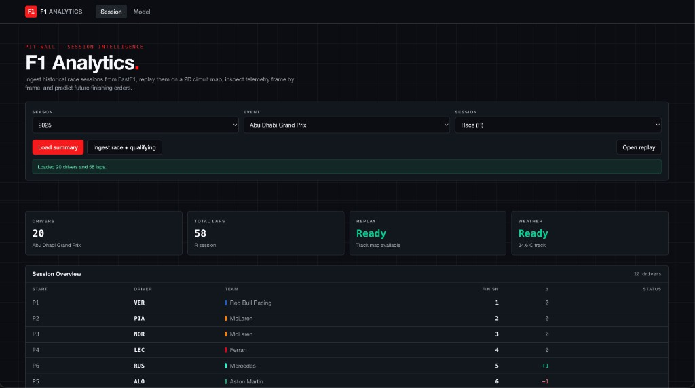
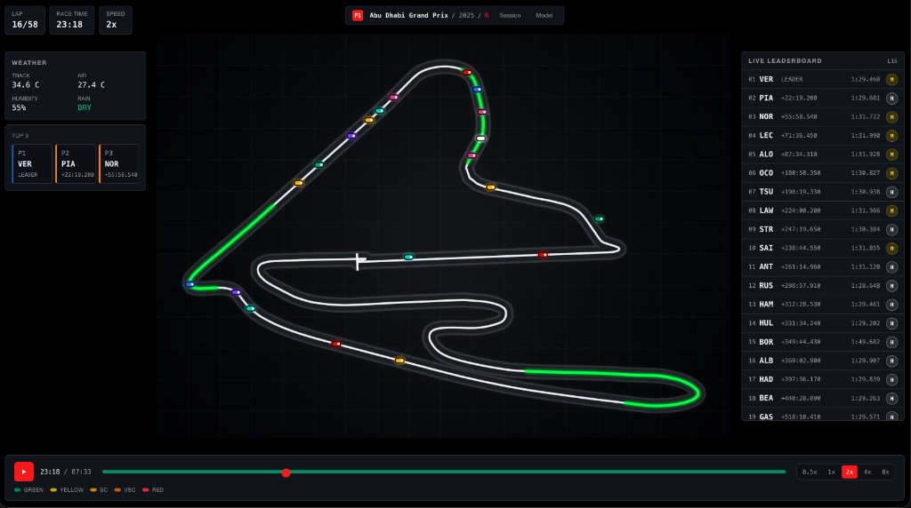
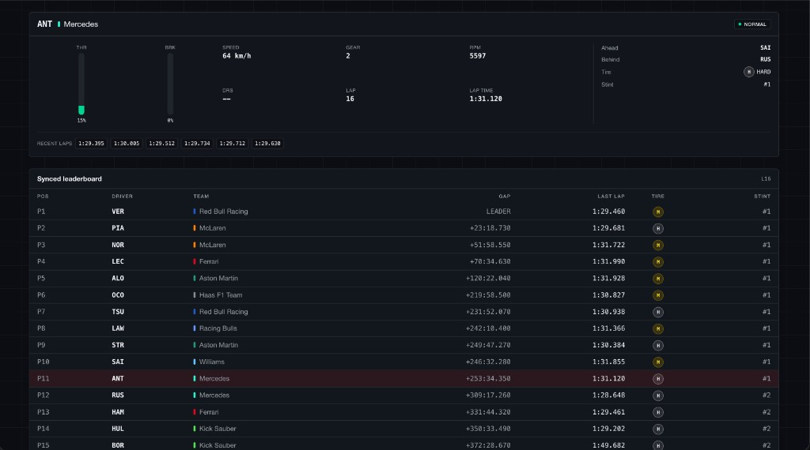
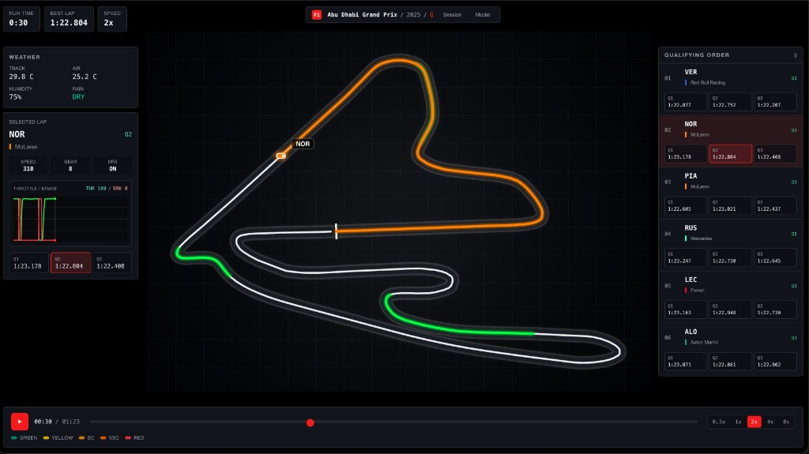
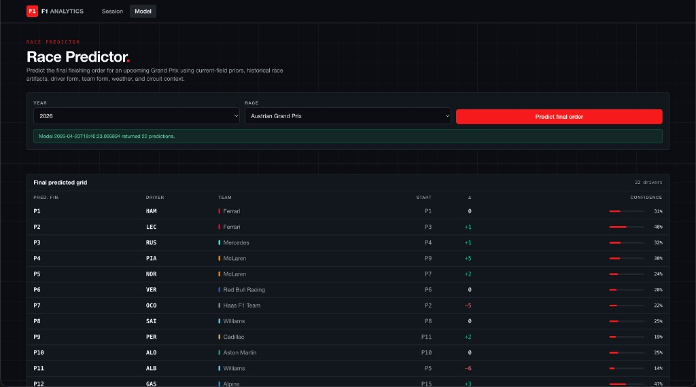

# Formula 1 Telemetry Analytics Platform

A local Formula 1 analytics app built with FastAPI, React, FastF1, and XGBoost.

The app can download real F1 session data, process it into replay and telemetry files, show an interactive race replay, and generate simple future-race finishing order predictions from locally trained model artifacts.

## Screenshots

Session view with season, event, and session selectors, summary stats, and results table after loading ingested data.



Interactive race replay: circuit map, live-style leaderboard, weather, top three, and playback controls.



Per-driver telemetry (throttle, brake, speed, gear, tires) with a time-synced leaderboard for the selected lap.



Qualifying replay with sector-colored trace, driver-focused telemetry, and Q1–Q3 times.



Model tab: predict final finishing order for a chosen Grand Prix with confidence bars.



## Features

- FastAPI backend for F1 session, replay, telemetry, ingest, and model endpoints
- React frontend with session selection, leaderboard views, replay controls, and prediction cards
- FastF1-based data ingestion for historical race sessions
- Local SQLite database for ingested session metadata
- XGBoost model pipeline for finishing-position predictions
- Docker Compose setup for running the full app locally

## Tech Stack

- Backend: Python, FastAPI, SQLAlchemy, Pandas, FastF1, XGBoost
- Frontend: React, TypeScript, Vite
- Data: SQLite plus local processed artifacts
- DevOps: Docker Compose and GitHub Actions

## Run With Docker

```bash
docker compose up --build
```

Open:

- Frontend: http://localhost:5173
- Backend health check: http://localhost:8000/health
- API docs: http://localhost:8000/docs

The app does not download the full dataset on startup. Use the frontend ingest controls for a single race first, or run the bootstrap command when you want to cache more recent seasons.

## Local Development

Backend:

```bash
cd backend
python -m venv .venv
source .venv/bin/activate
pip install -r requirements.txt
uvicorn app.main:app --reload
```

Frontend:

```bash
cd frontend
npm install
npm run dev
```

## Data Commands

Ingest one race:

```bash
docker compose exec backend python scripts/preprocess_sessions.py --seasons 2024 --events "Monaco Grand Prix" --session R --workers 1
```

Bootstrap recent seasons:

```bash
docker compose exec backend python scripts/bootstrap_data.py
```

Train the model:

```bash
docker compose exec backend python scripts/train_model.py
```

## Tests

Backend tests:

```bash
python3 -m pytest
```

Frontend build:

```bash
cd frontend
npm run build
```

GitHub Actions also runs backend tests and a frontend production build on pushes and pull requests.

## Project Structure

```text
backend/
  app/        FastAPI app, routes, schemas, services, and database setup
  scripts/    Data ingestion, feature building, model training, and evaluation
  tests/      Backend tests

frontend/
  src/        React app, pages, components, API client, and types

docker-compose.yml
```

## Notes

Generated data is intentionally not committed to Git. Local FastF1 cache files, processed session artifacts, model artifacts, SQLite databases, build output, Python caches, and `node_modules` are ignored.

If prediction fails because model artifacts are missing, ingest enough race data and run the training command again.
